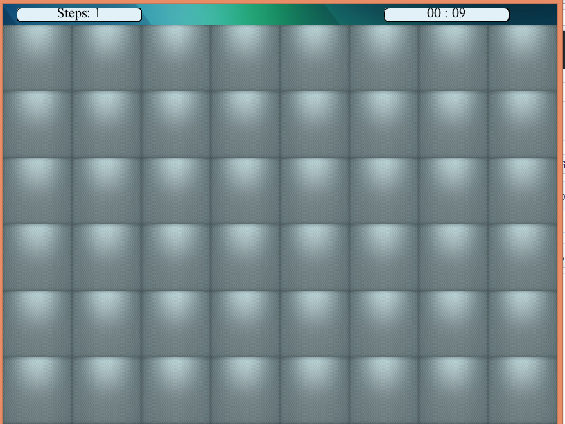
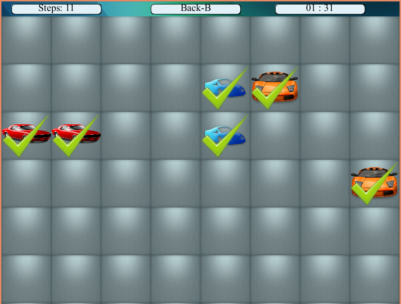

# Memory Game
This is simply a memory game in which a player has to match a pair of an object. 
It contains three screens: 
1. Main Screen:  
  It has three dialogs `Play`, `Help`, and `High Score`.  
  
1. Difficulty Level Screen: 
  It has `Easy`, `Normal`, and `Difficult` Mode based on the number of cards.  
  
1. Game Mode Screen: 
  It has `Timer`, `Steps Counter`, and `High Score` keeper.  
  
  
